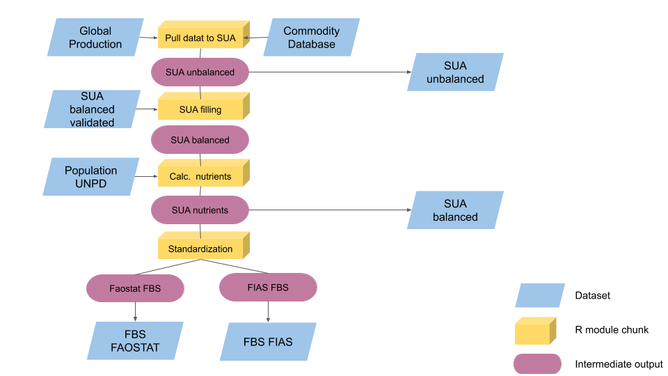
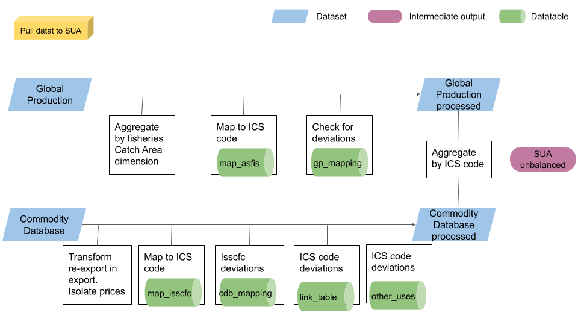
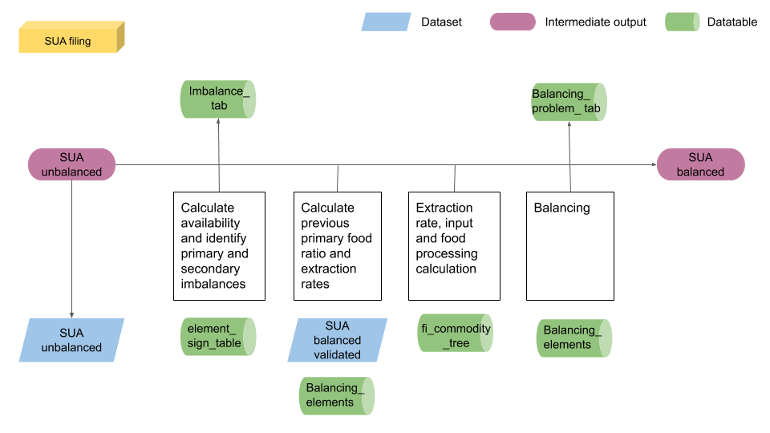

# **SUA-FBS compilation process** {#PluginDes}

To compile the SUA and FBS (both FIAS and Faostat standardization) a single plugin has been created to answer the technical unit request to minimize the user use of the SWS. The single plugin runs and compile four datasets the shiny app pulls data from. The user can then perform the needed modification through the shiny app.

The plugin initially pulls data from the Global production ad the Commodity datasets, the SUA unbalanced and balanced are then compiled with the support of auxiliary data tables and the Population dataset. Once the SUAs are ready the standardization process according to FIAS and Faostat methodology starts and compile the FBSs.

Figure \@ref(fig:pluginWF) shows the complete plugin workflow with the intermediate objects computed, intermediate savings and necessary external datasets.

```{r  pluginWF, echo=FALSE, out.width="100%", fig.cap='Plugin complete workflow.'}

```

## Initiate plugin

The plugin runs and saves data on sessions of the four involved datasets so, before initiating the plugin, it is advisable to create a session for each dataset. The datasets are all under the 'Fisheries Commodities' domain: 'SUA unbalanced fisheries', 'SUA balanced fisheries', 'FBS fisheries - Faostat standardized' and 'FBS fisheries - FIAS standardized' (fig. \@ref(fig:Initiate1)). 

```{r  Initiate1, echo=FALSE, out.width="100%", fig.cap='Select datasets to create sessions.'}
knitr::include_graphics("img/Initiate1.png")
```

After the four session are opened, select the 'FBS fisheries - FIAS standardized' dataset session and select the 'Run plugin' button. The follow the steps in figures \@ref(fig:Initiate1), \@ref(fig:Initiate2) and \@ref(fig:Initiate3)
First select the 'fi_SUA-FBS' plugin. Then select the session to run the plugin on. 
```{r  selectplugin1, echo=FALSE, out.width="100%", fig.cap='Plugin selection.'}
knitr::include_graphics("img/selectplugin1.png")
```

```{r  selectplugin2, echo=FALSE, out.width="100%", fig.cap='Select sessions to run plugin on.'}
knitr::include_graphics("img/selectplugin2.png")
```

The plugin allows for choosing the countries to run the plugin on. The use can either leave the 'countries' field blank, letting the plugin take the session selected countries or insert a list of countries, as in figure \@ref(fig:Initiate3), i.e. listing the M49 code of the countries separated by a comma and a space ', '. NOTE, the plugin will not run if the list is not structured in this way. The best way tested to run the plugin is to run it on around 25 countries each time to avoid too long listed not supported.
The year parameters are mandatory so the user must select the first and last year of the period.

```{r  selectplugin3, echo=FALSE, out.width="100%", fig.cap='Select countries and yearsto run the plugin on'}
knitr::include_graphics("img/selectplugin3.png")
```

## Pull data to SUA

To build the Supply-Utilization Account dataset, it is necessary to reconcile the information coming from the Primary Production and from the Commodity Database. Items, in these two datasets, are classified according to different classifications, ASFIS and ISSCFC respectively. This means that \textit{primary production}  and \textit{trade} data are characterized by a different level of detail in terms of species classification.

SUA equations are associated to ICS Faostat groups. This means that fish and fish products contained in each ICS item do not represent individual species or commodities, but the aggregation of different species and products. Species produced and commodities traded are conveyed into 8 main groups of similar biological characteristic, reflecting the ISSCAAP classification,  with further breakdowns associated to processed and preserved commodities.

Currently the SUAs/FBS for aquatic plants are not calculated (with the exception of three countries in Faostat) due to the lack of separate data for edible/non-edible trade until recently. Due to the improvement of the HS classification and the introduction of specific codes distinguishing edible from non-edible aquatic plants/seaweed, this could change in the near future.

The first part of the plugin process the Global production and the commodity dataset so that they can compile the SUA unbalanced dataset. Figure \@ref(fig:pulldata2sua) shows the process both datasets go through before entering the SUA unbalanced.
All production in tonnes of Global production is first aggregated in order to delete the unnecessary 'fisheriesCatchArea' dimension. Then all species are linked to their default ICS code (according to YBKlang file, 'map_asfis' data table).

Sometimes the default mapping tables do not provide the proper aggregations of ASFIS or ISSCFC codes into ICS groups. This means that some species or commodity or already aggregated flows have to be migrated from the default ICS group to an _ad-hoc_ one. These exceptions are country-year specific and a data-table has been created to host this information in a such a way as to be easily digest by the R script on one hand, and easily read and updated by any FIAS user on the other.
Exceptions for species in the Global production dataset are considered through the 'gp_mapping' data table. 

The process for the Commodity dataset has more steps.
First of all, re-export are considered as export since the SUA do not distinguish between them. Also, all the commodity with unit of measure in head and not in tonnes are ignored and values are set aside from quantities.
As for Global production all commodities are linked to their default ICS code ('map_isscfc' data table) and exceptions are accounted for with the 'cdb_mapping' data table. The 'link_table' is then considered and deviates one, two or the three flows of an ICS code to another one for a defined period. The deviation of any ICS aggregated flow to another, is typically based on a one to one relationship. Anyway, sometimes it is necessary to split the aggregated ICS flow into two or more alternative ICS groups. One to many relationships need an additional information: the percentage to split one ICS flow into many.  This additional information is also contained in the _link table_.

As last step some commodities are redirected to a different element than the original one. Usually import of an ICS group become get redirected to other utilizations or the seed element. 
The value elements of the Commodity dataset are also aggregated at ICS level taking the mean price.

When both Global production and Commodity database have lost their original level of detail and are aggregate at ICS level, they are bind together and form the SUA unbalanced which is saved in the selected session.

```{r  pulldata2sua, echo=FALSE, out.width="100%", fig.cap='Process of pulling data to SUA unbalanced.'}

```

## Fill SUA

The process of filling the SUA has the main steps shown in figure \@ref(fig:suafilling).
The first part of this sub-process is again to separate value elements from the rest as they do not take any role in the balancing process.
The availability for each ICS product is calculated with the help of the 'element_sign_ table' data table in the SWS. The signs are given according to the equation $Prod + Imp + Stock - Exp - Feed - Seed - Loss - Processing - Food - OtherUtil - Residuals= 0$.
The imbalances are identified and classified in 'primary' and 'secondary' imbalances.

Note the **primary** products, along with their codes are contained in the 'SUA-FBS: ICS product to FBS group' data table and reported in the following table:


| **Product name** | **Code Faostat Level 2 (SUA)** | **Code Faostat Level 1 (FBS)** |
|:-----------:|-------------------------|--------------------------------|
| Freshwater & diadromous fish	| 1501 |	10 |
| Demersal fish	| 1514 |	20 |
| Pelagic fish |	1527	| 30 |
| Marine fish nei | 1540 |	40 |
| Crustaceans | 1553 |	50 |
| Molluscs excl. cephalopods |	1562 | 60 |
| Cephalopods | 1570 | 70 |
| Aquatic mammals | 1579 | 80 |
| Aquatic animals nei | 1587 | 90 |
| Aquatic plants | 1594 |	99 |


```{r  suafilling, echo=FALSE, out.width="100%", fig.cap='Filling SUA. From SUA unbalance to SUA balanced.'}

```

Since there should not be any primary imbalance, they are immediately covered with element '5166 - Residual other uses', the element identified to indicate statistical imbalances. The figure assigned to this element is equal to the imbalance so that the imbalance is covered but no additional availability is allocated.

All other secondary imbalances are further analyzed. First of all, all secondary imbalances are stored into the 'imbalance_tab' data table to keep track of them. Then the imbalances of meal products are treated as primary imbalances so the '5166' element is used. For all the other imbalances the production is increased for a quantity equivalent to the imbalance, so that no additional availability is allocated. When production is increased the flag combination assigned is (I, i).

The availability is recalculated and useful historical data are retrieved from the validated data: Production, Food and extraction rates. Note this values are extracted for the whole requested time series with, in addition, the year before the start year; i.e. if the period selected is 2010-2017 the plugin loads historical data for period 2009-2017 (even if the last year is likely to be empty).

As the last year is likely the one to be imputed the plugin takes the ratio between food and production of the year before the last one and assign these shares to the corresponding primary groups. For all non-primary products the food share is assumed to be at least 3%. Note this part has been required to avoid all the processing to be assigned to the primary products instead of being distributed along the product chain. This share computation is done for all the products having food as balancing item. After this step extraction rates and input elements are calculated and the default commodity tree updated.
Before calculating the food processing for each product, the food figures are assigned preventing to allocate too much quantity to only one product.

### Extraction rate and input calculation

The function calculating extraction rates goes by layers. It first check if there are official inputs to calculate extraction rates from (flag (I, i). If no official extraction rate is found, it take the historical data and, if needed, applies a carry-forward estimation assigning as value the value of the previous year (flag (E, t)). If neither input nor historical data is available the default extraction rate is applied (flag (I, c)).
The extraction rates are then embedded into the other data.

The function calculating input figures starts from production and extraction rates figures and calculate the input as $Input = Prod/ExtrRate$. If there is an official figure for input this figure is kept instead of the calculated one. This is just a security step because if there is an official input the extraction rate has already been calculated as the ratio between production and input so the figures should be the same in both cases.
Input figures are then embedded into the other data.

### Food processing calculation and balancing

'Food Processing' represents the amount of each food item that is not consumed as it is, but it is allocated to one or more productive processes leading to one or more processed items. That's why to properly evaluate this component it is necessary to preliminary compile the production component for all the processed commodities. If one commodity is reported in the commodity tree as a final termination (cannot be used as input to produce any other processed items), the food processing component remains empty. In other words, only items classified as parents in the commodity tree, can eventually have a food processing different than zero.

For those items that have several child-commodities the _processing_ component will be the sum of the partial contribution of each one of the processed items whose production has been obtained through a productive process that had, as input, the primary item taken in consideration. The partial contributions to the processing represent the amount of parent item necessary to produce each child separately. This amount is associated to each child item (input).

The food processing computations assumes:

- For all processed and preserved items the _input_ element is computed. Note that the input is always expressed in terms of primary equivalent. Sometimes it may happen that the country releases official data also for the input component, the extraction rate is thus obtained as a ratio:

$extractionRate_{i}= \frac{production_{i}}{input_{i}}$

where \textit{i} runs over the processed and preserved commodity.

- Once _input_ for all processed and preserve commodities has been computed (actually missing), its aggregation, by parent, corresponds to the overall quantity of primary item that has been used to produce derived items. In other word it corresponds to the primary processing component.

- Finally the _primary processing_ just computed has to be compared with the primary availability to ensure that the overall amount of available primary item, is at least enough to cover the production of all the processed and preserved items. In case the primary availability is lower than the just computed processing, it is necessary to enlarge the set of parent items and to allow for the possibility that also a derived item can be used as input to produce by-products at a lower level in the supply-chain.

The choice of the alternative parent item to be used as input depends once again in the commodity tree. For this purpose, a rank-based method has been set so to assign to other product than primary the uncovered input. The rationale is to assign all the input to the highest rank product depending on the availability. The parent ranking is a way to identify what are the product to consider as first, secondary, tertiary, etc... parents while computing and assigning the processed products. There is somehow a hierarchy among products so that the production of one of them cannot be covered by any of the other product in the same major group. Primary products availability is the first considered, all the input that cannot be covered by primary products (parent rank 0) is assigned to secondary products. Among secondary products first rank parents (rank = 1) are considered first, then rank 2 parent, rank 3 until rank 4 which is the last identified rank.
Along the line controls are performed. The functions verify that secondary availability covers all the quantity primary products do not cover. The for each rank it is verified that there is enough availability to cover at least all the input of products having the following rank, e.g. rank 1 parent can cover at least rank 2 products, rank 2 can cover at least rank 3, etc...
Any inconsistency is stored in a list saved in a country-specific file and showed into the shiny app, stored into the 'balancing_problems_tab' data table and sent as an attachment to the email sent at the end of the plugin. Moreover, the uncovered part is assigned to the corresponding primary products balanced by an equal quantity assigned to the residual element 5166 which plays the role of augmenting the disposable quantity available to cover the imbalance. The use is required to fix these inconsistencies through the shiny app.

After the food processing calculation the balancing process starts, i.e. SUA equations still characterized by a positive unbalance need to be balanced. The FIAS best practice is based on the _single balancer_ approach: the total amount of imbalance is allocated to one component that is used as balancing element. All the remaining availability is assigned to the correspondent balancing element as stored into the 'balancing_element' data table. The availability is calculated again and the plugin checks all availability equal zero to ensure balancing process worked well.

For many SUA equations a single balancer may not be enough to properly allocate the overall amount of availability. It is possible that a too large amount of some commodities are allocated to one single component (generally _food_, _feed_ or _other utilizations_). To overcome this issue and to split the availability to more than one SUA component the user can manually impute any SUA elements (excluding the balancing element that will be automatically populated) in the SUA unbalanced table. Using the shiny app, the user can manually add another component. This operation will reduce the final availability that will be allocated to the balancing element.

## SUA with nutrients

After the SUA balanced dataset has been populated, **nutritive values** are calculated. Calories, proteins and fats, based on the resulting Food availability, are calculated
using official Nutritive Factors stored in the SWS. Values of Nutritive elements are stored in the system in the 'fishery_nutrient' data table, stored in the _Fisheries_ domain and provided by FIAS team.

After all Nutritive Values are calculated, the Dietary Energy Supply (DES) can be compiled. DES is given by:

$$
 DES_{ijt} = \cfrac{\cfrac{Kcal_{ijt}}{Population_{jt}}}{365}
$$
where the \(i\) index runs over all countries, the \(j\) index over all
commodities, and \(t\) over years.


After the SUA with nutrients is calculated, it is saved into SWS in the SUA balanced dataset and the standardization process can start.

## Standardization

Every primary product is the input for producing a broad variety of processed and preserved products. A modern food processing sector is characterized by a vast variety of different processed products.

The Standardization - the conversion and subsequent aggregation of processed products into their primary equivalents - aims to bring these products into a hierarchical order that reflects the various food processing chains in which primary products are converted into processed equivalents. The most straightforward way of depicting this hierarchy is in the form of commodity trees which contain a structured and clear set of relationships between commodities. 

Commodity trees are so-called because they 'stem' from one primary product and then branch out into one or successive levels of processed products, each level is linked by extraction rates. Commodity trees are designed to be exhaustive, such that all possible uses of a particular commodity are covered. This means that they can be more or less complicated depending upon the number of derived products, the number of processing levels, and the creation of 'parallel-products' during processing. 

As just mentioned, in the commodity-tree representation, each parent-child combination is characterized by an 'extraction rate'. Extraction rates reflect the amount of parent product contained in the next level of processed product.

Extraction rates are exogenously assumed. In terms of a broader interpretation, the extraction rate is the component that summarizes the overall level of technology associated to each productive process, so it is assumed to vary across countries and over time as consequence of improvements in the level of technology. Extraction rates should be periodically reviewed and updated to ensure they remain valid and reflect the real status of technology in the country. Extraction rates might also be computed as a ratio at the condition that the country provides the amount of primary item involved in each productive process.

When a single productive process leads to more than one processed item, the resulting two or more by-products are identified as parallel-products (or co-products). This means that from the same amount of parent-commodity it is possible to obtain several processed items. A common example of co-products are fillet and offals, the both deriving from the filleting process. A particular attention should be paid in standardize this kind of processed items: only one (out of two) processed items expressed in terms of its parent equivalent is sufficient to obtain the total amount of \textit{fish (fresh)} necessary to produce the both by-products. That is why 'offals' are generally assigned a weight equal to zero in the standardization process: this means that they are not standardized. A full list of commodity classified as co-product is available and embedded into the R routines in order to avoid double-counting.

Standardization is the process of expressing all the processed commodities in terms of their primary equivalent and to add up all the calories of the food commodities. One of the most important uses of the FBS consists indeed of measuring the overall average calorie supply in a country.
The Dietary Energy Supply (DES) is not only a standard output of the FBS, but also the key input into the FAO indicator of undernourishment, i.e. the number of undernourished people and the prevalence of undernourishment. 
In addition the FBS contains a complete picture of the source of consumption on that primary item in all its forms. This procedure allows comparisons among the various processed items deriving from the same primary item, across time and countries.


Some differences occur in the way standardization is carried out according to FIAS and Faostat methodologies. This difference mainly consists in the way meals data are handled, and in taking into account both edible and inedible products (as in Faostat) or only the edible component (as in FIAS). The final result of the total food fish supply and _per capita_ food fish supply is practically identical.  

The both approaches have to be implemented and their output will be used for different dissemination purposes.

The first step of the standardization process is to retrieve the commodity tree with the calculated extraction rates and to include the primary products (with extraction rate equal to one). Products figures can then be transformed into live-weight (primary) equivalent. All the figures are transformed but input (5302) already in live-weight equivalent, population and nutrient elements as calories and grams that do not change according to the way of expressing the product they come from.
Once all products are in live weight equivalent, input and production figures of secondary products are taken aside since they are already included into the food processing figures.
The figures are now ready to be aggregated according to major FAO groups. 

Until this point the standardization process for Faostat and FIAS are equivalent.
The the Faostat FBS is compiled using the 'fi_faostat_standardization_element' data table.
FIAS methodology is slightly longer since meals are accounted for separately from the rest of ICS products. The elements are then grouped and summed as in the 'fi_fias_standardization_element' data table.
Both FBS are saved into the corresponding datasets in the SWS.
